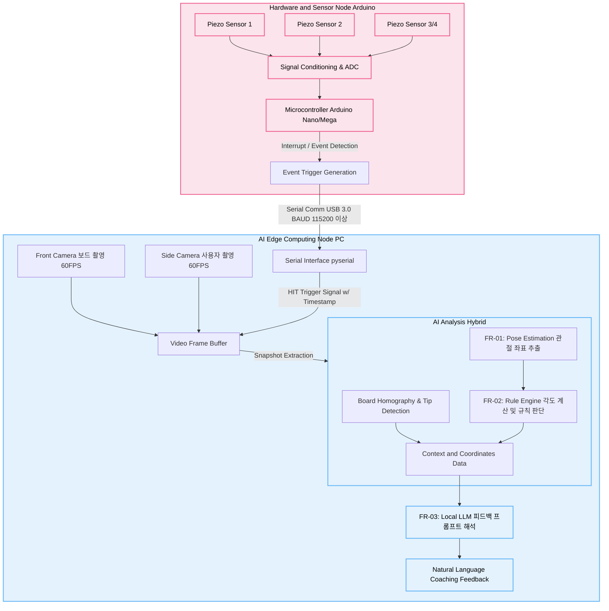

# AI 기반 다트 자세 교정 및 분석 플랫폼 - 요구사항 정의서 및 시스템 아키텍처

본 문서는 전기 엔지니어와의 하드웨어 및 통신 인터페이스 협의 및 코어 AI 엔진 설계 방향성을 확정하기 위해 작성된 기획 문서입니다. 다트판 센서와 카메라를 연동하여 투구 결과를 매칭하는 시스템의 뼈대를 정의하며, 특히 **두 가지 AI 분석 방식(하이브리드 관절 추출 vs VLM 통합 인지)**을 중점적으로 비교 분석합니다.

## 1. 프로젝트 개요
* **목표**: 사용자 투구 영상을 분석하여 자세 교정 피드백을 제공하고, 다트판 센서와 카메라를 연동하여 투구 결과(좌표)를 매칭하는 지능형 코칭 시스템 구축
* **핵심 컨셉**: 투구 순간(이벤트)을 하드웨어(센서)로 감지하고, 해당 프레임의 영상 데이터를 분석하여 지연 없는(Low-latency) 정교한 코칭 제공
* **주요 타겟**: 정확한 투구 자세 교정을 원하는 다트 동호인 및 입문자/프로 선수

---

## 2. 코어 AI 분석 방식 비교: 관절 추출(하이브리드) vs VLM 방식

다트 자세 분석의 핵심 '뇌' 역할을 할 AI 아키텍처는 크게 두 가지 방향으로 설계할 수 있습니다. 시스템의 연산 자원(1080 Ti)과 실시간성을 고려해 비교합니다.

### 💡 방식 A: 관절 추출 및 규칙 기반 하이브리드 아키텍처 (Pose + Rule + LLM)
영상에서 파악한 인간의 관절 좌표를 수학적으로 수치화한 뒤, 사전 정의된 '전문가 규칙'에 따라 오류를 진단하고 LLM으로 최종 코칭 문장을 다듬는 방식입니다. (현재 시스템 자원 대비 **가장 강력히 추천**하는 구조)

* **핵심 기능 요구사항 (FR)**
  * **`FR-01` [영상 분석] 관절 좌표 추출**: MediaPipe 또는 YOLOv8-Pose를 활용해 어깨, 팔꿈치, 손목 등 투구 핵심 관절의 실시간 좌표(x, y)를 고속 추출.
  * **`FR-02` [데이터 분석] 자세 규칙 엔진**: 추출된 좌표 기반으로 삼각함수를 적용해 팔꿈치 각도, 손목 스냅 타이밍 등을 수치화 및 정상 범위 1차 판독. (예: "팔꿈치 각도 < 150도 판단 시 오류로 마킹")
  * **`FR-03` [피드백 생성] 데이터 연동형 지능화**: 규칙 엔진의 판단 결과(숫자 데이터)를 LLM(ex. Llama-3 로컬 모델)에게 전달하여 "팔꿈치를 10도 더 펴주세요" 형태의 개인화 피드백 생성.
* **장/단점 비교**
  * **장점**: 연산량이 매우 가벼워 1080 Ti 환경에서 60FPS 이상의 실시간(Real-time) 분석 가능. "왜 자세가 틀렸는지" 수치적 근거(각도)를 명확하게 제시할 수 있음.
  * **단점**: "어깨의 긴장감", "다트 보드와의 전체적인 스탠스 균형" 등 단순히 좌표 몇 개로 정의하기 힘든 비정형적이고 정성적인 맥락 판독에는 한계가 존재.

### 💡 방식 B: VLM 기반 통인지 아키텍처 (FastVLM, LLaVA 직접 추론)
위와 같이 개별 관절 좌표를 따지 않고, 다트가 던져지는 핵심 순간의 영상/이미지 화면 전체를 시각언어모델(VLM)에 통째로 넣어 종합 판단을 맡기는 방식입니다.

* **핵심 기능 요구사항 (FR)**
  * **`FR-01 (VLM)` [통합 인지] 다중 채널 결합**: 별도의 좌표 추출 없이, 센서가 신호를 보낸 순간의 전후 프레임 스냅샷 2~3장을 VLM 딥러닝 인코더(Vision Encoder)에 직접 입력.
  * **`FR-02 (VLM)` [종합 분석] 의미론적 코칭 피드백 도출**: 수학적 룰 엔진 대신 VLM 자체가 영상을 직접 이해하고 "투구 시 무게 중심이 뒤로 쏠려 릴리즈 시 보드와 평행이 맞지 않습니다" 등의 거시적 맥락 피드백을 단 번에 생성.
* **장/단점 비교**
  * **장점**: 실제 사람 코치처럼 영상 전체의 맥락, 공간감, 선수의 상태(흔들림 뉘앙스) 파악 능력이 압도적임. 복잡한 IF-ELSE 규칙 엔진 코드를 개발할 필요가 없음.
  * **단점**: 무겁고 느림. 매 투구마다 이미지를 분석 시 1080 Ti의 제한된 VRAM(11GB) 한계에 부딪힐 확률이 높고, 1회 분석당 1~3초의 통신/지연(Latency)이 걸릴 수 있음. 명확한 '각도 수치'를 대주기는 힘듦.

> **💡 개발 전략 요약**: 
> 기초 프로토타이핑 및 전기 시스템과의 1차 연동은 속도와 안정성이 보장되는 **방식 A(관절 좌표 추출 + 규칙 엔진)**로 우선 구축합니다. 이후 프레임워크가 안정화되면, 규칙 엔진이 판단하기 모호한 까다로운 케이스이거나 "종합 정밀 분석" 옵션을 유저가 선택했을 때만 **방식 B(VLM)**를 제한적으로 호출하는 투-트랙(Two-track) 하이브리드 시스템이 가장 가성비가 뛰어납니다.

---

## 3. 하드웨어 구성 및 요구사항 설계 (전기/전자 파트 중심)

### 3.1 다트판 충격 감지 센서부 (Trigger Sensor)
AI 프로세싱(GPU 연산) 부하를 획기적으로 줄이기 위해 다트가 보드에 맞는 시점을 잡아 처리 장치로 넘기는 역할 (VLM이 매 트레임을 보느라 GPU 자원을 낭비하지 않게 함)
* **입력 방식 (압전 센서 기반 추천)**: 다트판 후면에 3~4개의 Piezo 센서 부착
  * 센서 역할: 물리적 타격 진동 감지 및 이벤트 트리거 발생 (AI 시스템에 스냅샷 캡처 시점을 지시)
  * 요구사항: 충격 시 발생하는 다중 바운싱 간섭을 로직(소프트웨어 딜레이) 또는 하드웨어 회로망(Schmitt Trigger / RC Filter)으로 반드시 걸러내야 함.
* **통신 컨트롤러**: 로컬 MCU (Arduino Nano / Mega 등)
  * 응답 속도 및 센서 간 도달 시간차(TDOA) 측정을 고려한 빠른 ADC 샘플링 적용.

### 3.2 비전 수집부 (Camera System)
* **카메라 구성 및 배치 (최대 2대 권장)**: 
  1. **보드 정면 카메라**: 다트가 꽂힌 위치(x, y) 정밀 판독 시 사용 (사다리꼴 투영 변환 적용 전제).
  2. **사용자 측면 카메라**: 투구 시 어깨-팔꿈치-손목 라인이 잘 보이는 화각에 배치하여 FR-01 관절 추출에 사용.
* **스펙 요구사항**: 다트 투구(릴리즈) 순간의 흔들림(Motion Blur) 방지와 프레임 동기화를 위해 **최소 60FPS 이상의 비전 장비 혹은 고성능 웹캠** (1080p 해상도 이상) 강제됨.

---

## 4. 시스템 아키텍처 다이어그램 (방식 A 적용 시 기준)

전체 시스템은 **[1] 하드웨어 센서 노드**, **[2] AI 엣지 컴퓨팅 노드(PC)** 로 나뉘어지며, Serial 통신 레이어를 통해 유기적으로 동작합니다.

---

## 5. 데이터 인터페이스 및 통신 규격 (Arduino ↔ PC)

전기 엔지니어 개발 파트는 다트 명중 시점의 **"이벤트 신호 생성 및 전송"** 만을 책임지며, 수많은 로직을 아두이노에서 연산하지 않습니다. 위치 보정 및 계산은 PC에서 수행합니다.

**[통신 규격]**
* **인터페이스**: USB Serial 단방향 통신
* **Baud Rate**: **115200bps 이상** 적용하여 통신 지연시간(Latency) 최소화
* **데이터 포맷 예시 (String Based)**
  * 트리거 즉시 송신 시: `HIT,102450\n` *(포맷: 이벤트타입, MCU_Timestamp_ms)*

---

## 6. 전기 엔지니어 핵심 협의 및 질의응답 (Q&A Checklist)

하드웨어 구현을 위해 전기 담당자(엔지니어)와 미팅 시 아래 4가지 항목을 명확히 합의해야 합니다.

1. **물리적 센서 배치**: 일반 다트판 후면에 압전 센서를 덧대어 TDOA(도달시간차)를 활용할 것인가? 아니면 멤브레인(저항막) 매트릭스 방식의 스위치판을 새로 제작할 것인가?
2. **이벤트 노이즈(디바운싱)**: 타격 이후 파생되는 진동(잔향 신호)을 소프트웨어 코드 단에서 딜레이를 주어 무시할 것인가, 회로 기판에서 LPF(Low-Pass Filter)로 무시할 것인가?
3. **카메라 트리거 레이턴시 허용 범위**: 투구자가 다트를 던지고 그것이 판에 꽂히기까지 걸리는 시간 동안, 카메라 프레임 버퍼를 어느 정도 길이(예: 1~2초 분량)로 항상 캐시해두어야 하는가?
4. **전원 및 USB 대역폭 한계**: 카메라 2대의 60FPS 실시간 송출과 Arduino 센서 통신이 동일 시스템(한 PC의 USB 컨트롤러)에서 병목 없이 전송 가능한 대역폭 설계가 되어 있는가?
