# AI 기반 다트 자세 교정 및 분석 플랫폼 — 기능 명세서 및 시스템 아키텍처

본 문서는 AI Dart Coach 시스템의 기능 명세와 아키텍처를 정의합니다.
이 문서는 **최종 목표인 iOS 온디바이스(On-device) 애플리케이션**으로의 전환을 염두에 두고, 현재 파이썬 프로토타입의 소프트웨어 구조 및 비전 기반 분석 파이프라인을 설계하는 데 사용됩니다.

## 1. 프로젝트 개요

* **목표**: 사용자 투구 영상을 분석하여 자세 교정 피드백을 제공하는 비전 기반 지능형 코칭 시스템 구축 (최종 형태: iOS 온디바이스 앱)
* **핵심 컨셉**: 투구 동작을 스마트폰 카메라 영상 분석으로 감지하고, 모바일 기기 내에서(On-device) 관절 데이터를 분석하여 지연 없는 정교한 코칭 제공
* **주요 타겟**: 정확한 투구 자세 교정을 원하는 다트 동호인 및 입문자/프로 선수
* **채택 아키텍처**: **관절 추출 + 규칙 엔진 + 템플릿 피드백** (현재 MediaPipe 기반 프로토타입, 향후 iOS Vision/CoreML 마이그레이션 예정)

---

## 2. 핵심 기능 요구사항 (FR)

### FR-01: 관절 좌표 추출 (Vision)
* **모듈**: `src/vision/mediapipe_pose.py` → `PoseExtractor` 클래스
* **구현**: MediaPipe Pose (model_complexity=2)로 12개 관절의 3D 좌표(x, y, z)를 프레임 단위 추출 (iOS 전환 시 Vision 프레임워크 또는 CoreML Pose 모델로 대체)
  * 추출 관절: 양쪽 어깨, 팔꿈치, 손목, 엉덩이, 검지, 새끼손가락
* **AV1 코덱 호환**: `src/utils/video_utils.py`에서 ffmpeg를 통한 자동 H.264 변환
* **출력**: `list[FrameData]` (프레임 인덱스 + 타임스탬프 + Keypoints)

### FR-02: 투구 자동 분리 및 자세 규칙 엔진 (Analysis)
* **모듈**: `src/vision/rule_engine.py` → `PoseRuleEngine` 클래스
* **투구 분리 (Multi-throw Segmentation)**: 손목 XY 속도의 velocity-based 구간 분석으로 연속 투구를 자동 분리
* **단계 감지 (Phase Detection)**: 각 투구에서 address → takeback → release → follow-through 4단계를 X축 위치 기반으로 자동 탐지
* **생체역학 지표 계산** (Huang et al., 2024 논문 기반):

| 지표 | 설명 | 임계값 (config.py) |
|------|------|-------------------|
| 팔꿈치 Y 안정성 | 투구 중 팔꿈치 높이 분산 | > 0.005 → 불안정 |
| 테이크백 최소 각도 | 어깨-팔꿈치-손목 최소 각도 | < 30° 너무 깊음 / > 110° 너무 얕음 |
| 릴리즈 팔꿈치 속도 | 릴리즈 시 팔꿈치 펴는 각속도 (절대값) | < 150°/s → 느림 |
| 손목 스냅 속도 | 릴리즈 시 손목 palmar flexion 각속도 | 참고 지표 (임계값 없음) |
| 상체 흔들림 | 어깨 X 변위 (address ~ release) | > 0.05 → 흔들림 |
| 어깨 Y 안정성 | 어깨 높이 분산 | > 0.003 → 불안정 |

* **투구 간 일관성 분석**: 테이크백 각도 분산(>15°), 팔꿈치 속도 분산(>80°/s) 감지
* **출력**: `SessionResult` (투구별 ThrowAnalysis + 이슈 목록)

### FR-03: 코칭 피드백 생성 (Template-based / LLM Skeleton)
* **모듈**: `src/llm/feedback_generator.py` → `FeedbackGenerator` 클래스
* **룰 엔진 기반 템플릿**: 8개 한국어 피드백 템플릿으로 분석 결과에 따른 자동 코칭 생성
  * `elbow_unstable_y`, `takeback_too_deep/shallow`, `slow_elbow_extension`, `body_sway_detected`, `shoulder_unstable`, `inconsistent_takeback`, `inconsistent_elbow_speed`
* **LLM Skeleton**: Ollama 연동을 위한 구조적 코드 유지 (현재 비활성화)
* **출력**: 한국어 코칭 피드백 문자열

---

## 3. 데이터 모델 (`src/models.py`)

```
FrameData(frame_index, timestamp_ms, keypoints?)
    └── Keypoints(12개 관절 × [x, y, z])

SessionResult(total_frames, fps, throws[], llm_feedback)
    └── ThrowAnalysis(throw_index, throwing_arm, frame_range, phases, metrics, issues[])
        ├── ThrowPhases(address, takeback_start, takeback_max, release, follow_through)
        └── ThrowMetrics(elbow_stability, takeback_angle, elbow_vel, wrist_vel, sway, ...)
```

---

## 4. 시스템 아키텍처 다이어그램 (Python Prototype)

전체 시스템은 비전 기반으로 동작하며, **향후 iOS 기기(iPhone/iPad)의 온디바이스(On-device)** 환경으로 이식될 것을 전제로 설계되었습니다. 아래는 현재 검증용 Python 프로토타입의 파이프라인입니다.

```mermaid
graph TD
    %% S/W 파이프라인
    subgraph iOS_Target ["Target: iOS On-device Environment (Current: Edge PC)"]
        Camera["Mobile Camera / Video File"] --> VideoInput["Video Input / Frame Buffer"]

        VideoInput --> PoseExt["PoseExtractor (MediaPipe / iOS Vision)"]

        subgraph Analysis ["Analysis Pipeline (To be converted to Swift)"]
            PoseExt -- "list of FrameData" --> Segment["Multi-throw Segmentation"]
            Segment -- "throw segments" --> PhaseDetect["Phase Detection"]
            PhaseDetect --> Metrics["Biomechanical Metrics"]
            Metrics --> Issues["Issue Detection + Consistency"]
        end

        Issues -- "SessionResult" --> Feedback["FeedbackGenerator (Template Engine)"]
        Feedback --> Output["Coaching Feedback (UI / JSON)"]
    end

    %% Styles
    classDef sw fill:#e3f2fd,stroke:#64b5f6,stroke-width:2px,color:#000000;
    classDef analysis fill:#e8f5e9,stroke:#66bb6a,stroke-width:2px,color:#000000;
    class Camera,VideoInput,PoseExt,Feedback,Output sw;
    class Segment,PhaseDetect,Metrics,Issues analysis;
```



---

## 5. 실행 모드

### 비디오 분석 모드 (Video Analysis Mode)
```bash
uv run src/main.py --input data/sample_1.mp4 --output-json output/report.json
```
파이프라인: 비디오 파일 → 코덱 변환 → 관절 추출 → 투구 분리 → 분석 → 피드백 → JSON 리포트

---

## 6. 비전 수집부 요구사항 (Camera System)
* **사용자 측면 카메라**: 어깨-팔꿈치-손목 라인이 보이는 화각으로 배치
* **최소 사양**: 60FPS 이상, 1080p 해상도 이상
