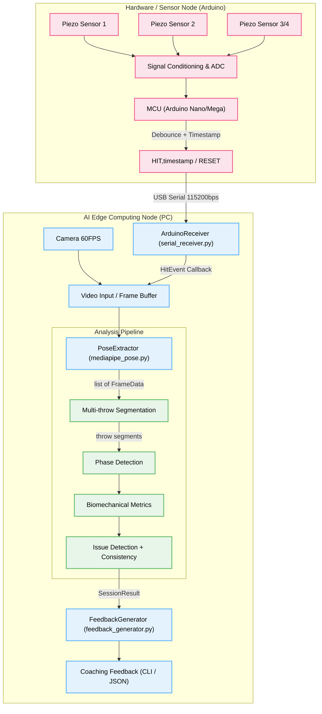

# AI 기반 다트 자세 교정 및 분석 플랫폼 — 기능 명세서 및 시스템 아키텍처

본 문서는 AI Dart Coach 시스템의 기능 명세와 아키텍처를 정의합니다.
전기 엔지니어와의 하드웨어 인터페이스 협의 및 소프트웨어 구조 설계에 사용됩니다.

## 1. 프로젝트 개요

* **목표**: 사용자 투구 영상을 분석하여 자세 교정 피드백을 제공하고, 다트판 센서와 카메라를 연동하여 투구 결과를 매칭하는 지능형 코칭 시스템 구축
* **핵심 컨셉**: 투구 순간(이벤트)을 하드웨어(센서)로 감지하고, 해당 프레임의 영상 데이터를 분석하여 지연 없는(Low-latency) 정교한 코칭 제공
* **주요 타겟**: 정확한 투구 자세 교정을 원하는 다트 동호인 및 입문자/프로 선수
* **채택 아키텍처**: **방식 A — 관절 추출 + 규칙 엔진 + LLM 하이브리드** (MediaPipe Pose 기반)

---

## 2. 핵심 기능 요구사항 (FR)

### FR-01: 관절 좌표 추출 (Vision)
* **모듈**: `src/vision/mediapipe_pose.py` → `PoseExtractor` 클래스
* **구현**: MediaPipe Pose (model_complexity=2)로 12개 관절의 3D 좌표(x, y, z)를 프레임 단위 추출
  * 추출 관절: 양쪽 어깨, 팔꿈치, 손목, 엉덩이, 검지, 새끼손가락
* **AV1 코덱 호환**: `src/utils/video_utils.py`에서 ffmpeg를 통한 자동 H.264 변환
* **출력**: `list[FrameData]` (프레임 인덱스 + 타임스탬프 + Keypoints)

### FR-02: 투구 자동 분리 및 자세 규칙 엔진 (Analysis)
* **모듈**: `src/vision/rule_engine.py` → `PoseRuleEngine` 클래스
* **투구 분리 (Multi-throw Segmentation)**: 손목 XY 속도의 velocity-based 구간 분석으로 연속 투구를 자동 분리
* **단계 감지 (Phase Detection)**: 각 투구에서 address → takeback → release → follow-through 4단계를 X축 위치 기반으로 자동 탐지
* **생체역학 지표 계산** (Huang et al., 2024 논문 기반):

| 지표 | 설명 | 임계값 (config.py) |
|------|------|-------------------|
| 팔꿈치 Y 안정성 | 투구 중 팔꿈치 높이 분산 | > 0.005 → 불안정 |
| 테이크백 최소 각도 | 어깨-팔꿈치-손목 최소 각도 | < 30° 너무 깊음 / > 110° 너무 얕음 |
| 릴리즈 팔꿈치 속도 | 릴리즈 시 팔꿈치 펴는 각속도 (절대값) | < 150°/s → 느림 |
| 손목 스냅 속도 | 릴리즈 시 손목 palmar flexion 각속도 | 참고 지표 (임계값 없음) |
| 상체 흔들림 | 어깨 X 변위 (address ~ release) | > 0.05 → 흔들림 |
| 어깨 Y 안정성 | 어깨 높이 분산 | > 0.003 → 불안정 |

* **투구 간 일관성 분석**: 테이크백 각도 분산(>15°), 팔꿈치 속도 분산(>80°/s) 감지
* **출력**: `SessionResult` (투구별 ThrowAnalysis + 이슈 목록)

### FR-03: 코칭 피드백 생성 (LLM / Template)
* **모듈**: `src/llm/feedback_generator.py` → `FeedbackGenerator` 클래스
* **Ollama LLM 연동**: `http://localhost:11434/api/generate` 호출 → 다트 코치 역할 프롬프트로 자연어 피드백 생성
* **템플릿 Fallback**: Ollama 미설치 시 8개 한국어 피드백 템플릿으로 자동 대체
  * `elbow_unstable_y`, `takeback_too_deep/shallow`, `slow_elbow_extension`, `body_sway_detected`, `shoulder_unstable`, `inconsistent_takeback`, `inconsistent_elbow_speed`
* **출력**: 한국어 코칭 피드백 문자열

### FR-04: 하드웨어 센서 연동 (Hardware)
* **모듈**: `src/hardware/serial_receiver.py` → `ArduinoReceiver`, `KeyboardSimulator` 클래스
* **프로토콜**: USB Serial 115200bps, `HIT` / `HIT,timestamp` / `HIT:score:zone` / `RESET` 지원
* **이벤트 콜백**: `on_hit(HitEvent)`, `on_reset()` 콜백 패턴으로 비동기 수신
* **자동 재연결**: 시리얼 연결 끊김 시 자동 재연결 시도
* **시뮬레이터**: 키보드 입력으로 하드웨어를 에뮬레이션 (Enter=HIT, r=RESET, q=QUIT)
* 상세 통신 규격: [HARDWARE_INTERFACE.md](HARDWARE_INTERFACE.md) 참조

---

## 3. 데이터 모델 (`src/models.py`)

```
FrameData(frame_index, timestamp_ms, keypoints?)
    └── Keypoints(12개 관절 × [x, y, z])

SessionResult(total_frames, fps, throws[], llm_feedback)
    └── ThrowAnalysis(throw_index, throwing_arm, frame_range, phases, metrics, issues[])
        ├── ThrowPhases(address, takeback_start, takeback_max, release, follow_through)
        └── ThrowMetrics(elbow_stability, takeback_angle, elbow_vel, wrist_vel, sway, ...)
```

---

## 4. 시스템 아키텍처 다이어그램

전체 시스템은 **[1] 하드웨어 센서 노드**, **[2] AI 엣지 컴퓨팅 노드(PC)** 로 구성됩니다.



---

## 5. 실행 모드

### 비디오 모드 (Video Mode)
```bash
uv run python src/main.py --mode video --input data/sample_1.mp4 --output-json output/report.json
```
파이프라인: 비디오 파일 → 코덱 변환 → 관절 추출 → 투구 분리 → 분석 → 피드백 → JSON 리포트

### 라이브 모드 (Live Mode)
```bash
# 실제 하드웨어
uv run python src/main.py --mode live --port /dev/ttyUSB0

# 키보드 시뮬레이터
uv run python src/main.py --mode live --simulate
```
파이프라인: 센서 트리거 → 실시간 관절 추출 → 투구 분석 → 피드백

---

## 6. 하드웨어 구성 요구사항

### 6.1 다트판 충격 감지 센서부 (Trigger Sensor)
* **입력 방식**: 다트판 후면 3~4개 Piezo 센서 부착
  * 충격 시 다중 바운싱을 하드웨어 회로(LPF / Schmitt Trigger) 또는 소프트웨어 딜레이로 필터링
* **통신 컨트롤러**: Arduino Nano/Mega, 115200bps Serial

### 6.2 비전 수집부 (Camera System)
* **사용자 측면 카메라**: 어깨-팔꿈치-손목 라인이 보이는 화각으로 배치
* **최소 사양**: 60FPS 이상, 1080p 해상도 이상

---

## 7. 전기 엔지니어 핵심 협의 체크리스트

1. **물리적 센서 배치**: 압전 센서를 덧대어 TDOA를 활용할 것인가? 멤브레인 매트릭스 방식인가?
2. **이벤트 노이즈(디바운싱)**: 소프트웨어 딜레이 vs 회로 기판 LPF — 어느 쪽으로 구현하는가?
3. **카메라 트리거 레이턴시**: 카메라 프레임 버퍼를 어느 정도(1~2초) 캐시해야 하는가?
4. **전원 및 USB 대역폭**: 카메라 + Arduino 통신이 병목 없이 동시 전송 가능한가?
5. **LED 피드백 수신**: PC → Arduino 역방향 통신으로 LED/부저 피드백을 구현할 것인가?
